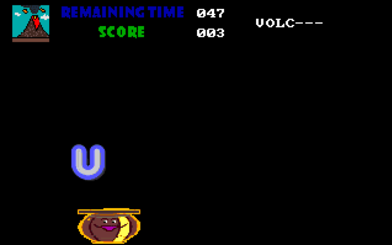

# Spell-It

assembly game to teach the spelling of some basic words in a fun way


## Getting Started

These instructions will get you a copy of the project up and running on your local machine for development and testing purposes

### Prerequisites

you just need to download **dosbox** version based on your machine from here 
[](https://www.dosbox.com/download.php?main=1 "dosbox")


### Installing

to open the game open the dosbox and type those commands

```
mount C "full path of the code between those quotation marks"
C:
game.exe
```

in case you wanted to build the game from the code type in the dosbox thos commands
```
mount C "full path of the code between those quotation marks"
C:
build
```
*build is batch written to masm and link the necessary files and run the game altogether*

## Playing the game

```
click with the mouse to choose the desired difficulty
```


```
click with the mouse to choose the desired level
```


```
use left and right arrows to move the basket and catch the right falling letters before time ends
when you collect all the words you win the game and get redirected to choose another level
```



*note that completed levels can't be repeated unless you reopen the game*


## Built With

* [MASM](https://docs.microsoft.com/en-us/cpp/assembler/masm/) 


## Author

* **Muhammad Ahmad Hesham** - *Initial work* - [Etshawy1](https://github.com/Etshawy1)

## License

Licensed under the [MIT License](LICENSE).

## Acknowledgments

* this repo helped me alot to integrate sound into the game https://github.com/leonardo-ono/Assembly8086SBHardwareLevelDspProgrammingTest

